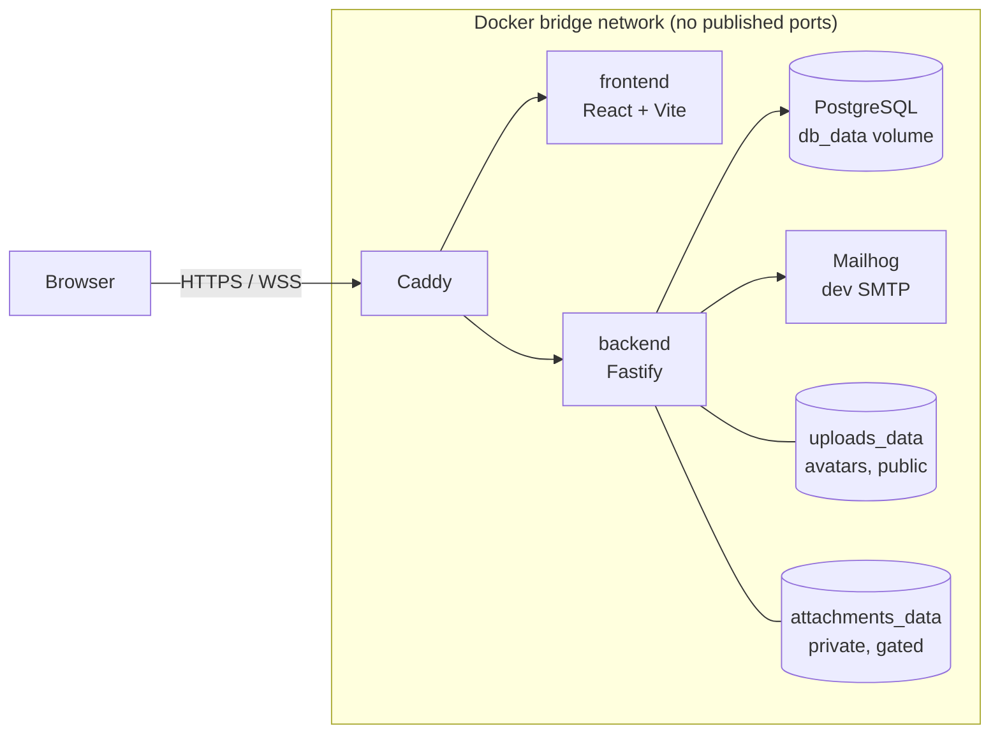
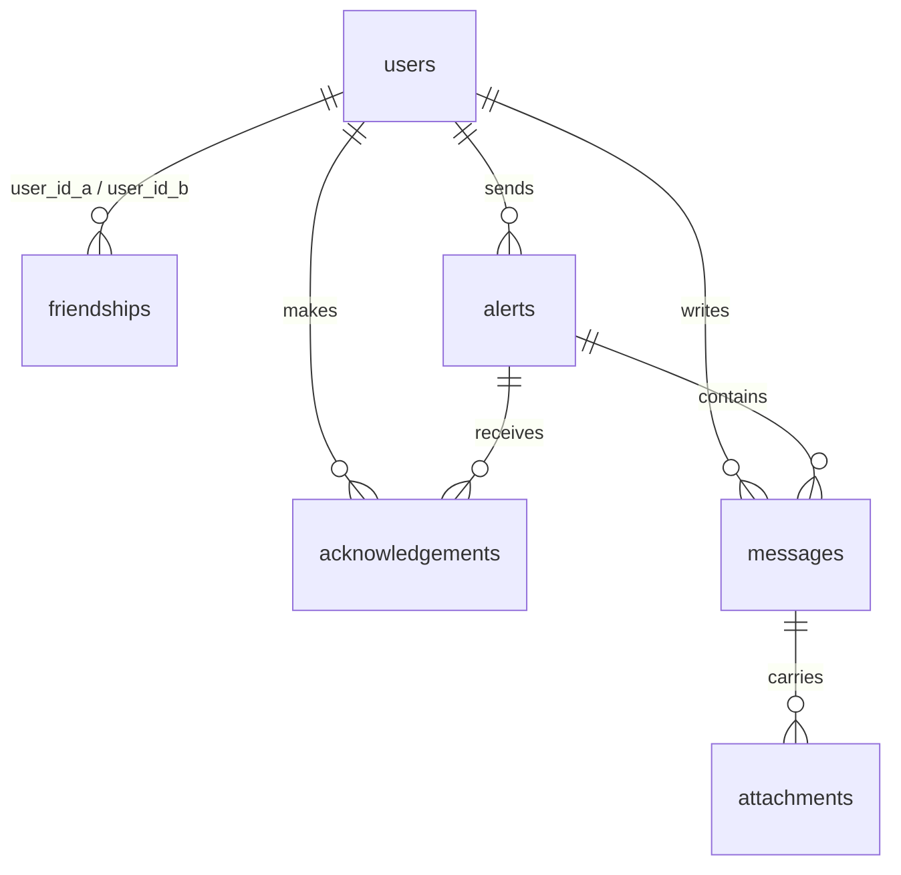

*This project has been created as part of the 42 curriculum by evmouka, mosokina, mtocu and aaladeok.*

# Check-in

A web app for sending check-in alerts to a small circle of trusted friends.

---

## Table of Contents

1. [Description](#1-description)
2. [Team Information](#2-team-information)
3. [Project Management](#3-project-management)
4. [Technical Stack](#4-technical-stack)
5. [Database Schema](#5-database-schema)
6. [Instructions](#6-instructions)
7. [Features List](#7-features-list)
8. [Modules](#8-modules)
   - [Frameworks](#frameworks-for-frontend-and-backend--web--major--2-pts) · [WebSockets](#real-time-websockets--web--major--2-pts) · [Standard User Management](#standard-user-management--user-management--major--2-pts) · [User Interaction](#user-interaction--web--major--2-pts) · [ORM](#orm--web--minor--1-pt) · [Notifications](#notification-system--web--minor--1-pt) · [PWA](#progressive-web-app-pwa--web--minor--1-pt) · [Design system](#custom-design-system--web--minor--1-pt) · [File upload](#file-upload-and-management--web--minor--1-pt) · [GDPR](#gdpr-compliance--data-and-analytics--minor--1-pt) · [OAuth](#oauth--user-management--minor--1-pt) · [Multi browsers](#multiple-browser-support---web--minor--1-pt)
9. [Individual Contributions](#9-individual-contributions)
10. [Project Structure](#10-project-structure)
11. [Legal Pages](#11-legal-pages)
12. [Resources & AI Usage](#12-resources--ai-usage)

---

## 1. Description

**Check-in** is a web app for telling a small circle of trusted friends that
you are not okay, without having to explain yourself.

A user sends a check-in — *I need a chat*, *I'm not okay*, *could someone reach
out* — and the friends they have already accepted are notified in real time.
Any of them can acknowledge it, which tells the sender they have been seen, and
open a private conversation from there. The sender closes the check-in when
they are all right again.

The problem it solves is the gap between "fine" and "emergency". Reaching out
usually means starting a conversation, choosing words, and explaining why —
which is hardest exactly when it matters most. Check-in reduces that to one
button and a short list of people who already agreed to be on it.

This is **not an emergency service**. For real emergencies, people call 999 or
112. The app says so on the check-in form, in the footer of every page, and in
the Terms of Service — and that position is load-bearing elsewhere in the
product, which is why the check-in button is amber rather than emergency-red.

### Key features

- **Send a check-in** in one tap, with an optional note, from three types
- **Real-time delivery** to accepted friends over WebSockets — no polling, no refresh
- **Acknowledgement** so the sender can see they have been seen
- **Private conversation** on each check-in, with image and PDF attachments
- **Friends by mutual consent** — send, accept, decline, remove; nothing is shared until both sides agree
- **Live online status** for friends, updating without a refresh
- **Profile and avatar** management
- **Installable and offline-capable** as a Progressive Web App
- **Your data is yours** — download everything the app holds about you, or delete your account and have it erased
- **HTTPS everywhere**, with the app reachable only through a TLS-terminating reverse proxy

---

## 2. Team Information

| Intra login | GitHub | Name | Role(s) | Responsibilities |
|---|---|---|---|---|
| `evmouka` | cloudlitsa | Litsa | Product Owner + Developer | Product scope and module strategy, real-time WebSocket layer, alerts, custom design system, HTTPS and proxy setup, code review |
| `mosokina` | wise_owl | Maria | Tech Lead + Developer | Technical decisions, file upload and management, chat frontend, online status, user management, code review |
| `aaladeok` | Lexymma | Ade | Project Manager + Developer | Board and delivery tracking, chat backend, OAuth |
| `mtocu` | mihaellatocu | Mihaela | Developer | Terms of Service and Privacy Policy, legal page routing and footer links, review |

The subject allows PO, PM and Tech Lead to double as developers, and all four
do.

---

## 3. Project Management

**How the work was split.** One module, one owner, end to end — backend,
frontend and documentation together. That way every member has work they can
explain on their own, which is what the evaluation asks for. Where a module was
too big for one person, the seam was the API boundary, not the middle of a
feature: chat backend and chat frontend were separate tickets with separate
owners, agreed against a fixed response shape.

Scope was fixed early and defended. We target the minimum 14 points rather than
a larger number. The full reasoning, including the decisions we later reversed,
is in `docs/PROJECT.md`.

**Tools.** Jira for the board (project `TRAN`). GitHub for code and review.
Slack for coordination, Discord for informal chat.

**Working agreements.**

- Every change goes through a pull request. One approving review, then squash
  and delete the branch. Nobody merges their own work unreviewed.
- Automated review runs first, before a human looks. Its comments get replied
  to on the thread, not silently resolved — see *Resources & AI Usage*.
- Decisions that shape the code go in `docs/DECISIONS.md` when they are taken,
  with the alternatives we rejected. Decisions that shape the scope go in
  `docs/PROJECT.md`.
- Gotchas that cost someone an afternoon go in `docs/DEVELOPMENT.md` so they
  cost the next person five minutes.

**Meetings.** Short check-ins on Slack rather than a fixed standup, and longer
sessions when a decision needed several people — the WebSocket library, the
module tally, and the OAuth account-linking design were all settled that way.

---

## 4. Technical Stack



**Frontend.** React + TypeScript, built with Vite, routed with
`react-router-dom`, styled with Tailwind CSS v4. `vite-plugin-pwa` generates
the service worker and manifest.

**Backend.** Fastify + TypeScript, with `@fastify/websocket`,
`@fastify/multipart` and `@fastify/static`. Zod validates every route.
bcryptjs hashes passwords at cost 12.

**Database.** PostgreSQL with Prisma.

**Infrastructure.** Docker Compose runs five services. Caddy terminates TLS as
the single public entry point. mkcert generates development certificates per
machine. Mailhog catches confirmation emails in development.

### Why these

**React** because the UI updates from a socket rather than from clicks, and a
component model handles that cleanly — an event sets state and every subscriber
re-renders. It was also the framework the team most wanted to learn properly.

**Fastify** because it is lighter than Express, has first-class WebSocket
support, and its plugin model makes route-level auth hooks natural: a route
inside a guarded plugin is guarded by default.

**Raw WebSockets over Socket.IO.** `@fastify/websocket` reuses the existing
cookie and JWT auth path, adds nothing to the client bundle, and the protocol
is the thing the module asks us to demonstrate. Full rationale in
`docs/DECISIONS.md`.

**PostgreSQL** because the data is relational in the strict sense and the app
depends on real foreign keys. `ON DELETE CASCADE` is what makes account
deletion correct rather than a hand-written list of deletes that goes stale
when a table is added. We also rely on a partial unique index, which needs a
database that supports one.

**Prisma** because the ORM module needs an ORM that is genuinely used. One
schema generates a typed client, so a renamed column is a compile error rather
than a runtime one; queries are parameterised by default; migrations are
reviewable files in git.

**Tailwind v4** because it gives us design tokens defined once in `@theme` —
One plugin and one CSS import.

**Caddy** because it terminates TLS in a few lines and forwards WebSocket
upgrade headers transparently, so `wss://` works with no extra configuration.

**TypeScript on both sides** so a response shape is declared once. Change what
an endpoint returns and the consumer fails to compile, rather than failing in
the browser.

**And no game.** Games are heavy — multiplayer sync, AI opponents, tournaments
as CRUD on game state. A check-in app puts most of its modules on the same
infrastructure instead. That overlap is why the scope was achievable.

---

## 5. Database Schema



Every one of those cascades on delete - it's what makes GDPR erasure one operation.

Six tables. Every relationship is a real foreign key, and every one that points
at a user cascades on delete — which is what makes the GDPR erasure right work.

| Table | What it holds | Key fields |
|---|---|---|
| `users` | Accounts | `id` UUID PK · `email` text, unique · `password_hash` text, **nullable** (null for Google-only accounts) · `google_id` text, unique, nullable · `display_name` text · `avatar_url` text, nullable · `created_at` / `updated_at` timestamptz |
| `friendships` | One row per pair, in either direction | `id` UUID PK · `user_id_a` / `user_id_b` UUID FK → users · `status` (pending / accepted / blocked) · `requester_id` UUID, so the receiving side can be told apart from the sending side |
| `alerts` | The check-ins | `id` UUID PK · `sender_id` UUID FK → users · `alert_type` enum (`need_chat` / `not_okay` / `reach_out`) · `status` enum (active / closed), default active · `note` text, nullable · `created_at` timestamptz · `closed_at` timestamptz, nullable |
| `acknowledgements` | One row per friend per alert — "I see you" | `alert_id` + `user_id` **composite PK** (both FK, to alerts and users) · `acknowledged_at` timestamptz. The pair being the primary key is what makes a duplicate impossible — a double-click cannot record two |
| `messages` | Chat, attached to an alert | `id` UUID PK · `alert_id` UUID FK → alerts · `sender_id` UUID FK → users · `content` text · `created_at` timestamptz · index on `(alert_id, created_at)` |
| `attachments` | A file hanging off a message | `id` UUID PK · `message_id` UUID FK → messages · `filename` text (the stored `<uuid>.<ext>`) · `original_name` text (for display and download) · `mime_type` text · `size` int · `created_at` timestamptz · `deleted_at` timestamptz nullable · index on `message_id` |

### Two design decisions

**Cascade delete is enforced by the schema, not by application code.** Deleting
a user removes their friendships, alerts, acknowledgements, messages and
attachment rows in one database operation. `messages` is reached by *two*
cascade paths — `sender_id → users` and `alert_id → alerts → users` — so
deleting an account removes the user's messages wherever they wrote them, and
every message inside an alert they sent, whoever wrote it. That is deliberate:
a check-in thread is a conversation about one person's distress, and we treat
the whole thread as theirs rather than leaving it readable after they have
gone.

Files are not rows, so the account-deletion route collects filenames *before*
the delete and unlinks them afterwards. See *GDPR Compliance* under *Modules*.

**One active check-in per person, enforced by a partial unique index:**

```sql
CREATE UNIQUE INDEX one_active_alert_per_sender
  ON alerts (sender_id) WHERE status = 'active';
```

The original code did `findFirst` then `create`, which is not atomic — five
simultaneous requests could create five active alerts. Peer review caught it.
The database now enforces the rule, and Prisma's `P2002` unique-violation error
is returned as a `409`. Verified with five concurrent sends: exactly one `201`
and four `409`s.

It has to be **partial**. A plain unique index on `sender_id` would stop a user
ever sending a second check-in after closing the first; `WHERE status =
'active'` means only live rows collide.

---

## 6. Instructions
### Prerequisites

- Docker and Docker Compose installed
- [mkcert](https://github.com/FiloSottile/mkcert) installed — on macOS:
  `brew install mkcert nss` (`nss` lets mkcert write to Firefox's trust store too)
- Ports 80 and 443 free

### Setup

1. Copy the environment template:
   ```
   cp .env.example .env
   ```

2. Edit `.env` and set values. You MUST set all of these — the backend refuses
   to start if any is missing, which is deliberate: a loud failure at startup
   beats a server that runs and then breaks at sign-in.
 
   - `POSTGRES_PASSWORD` — any strong password. Avoid `@`, `:`, `/` and `#`:
     the password is interpolated into `DATABASE_URL`, and those characters
     break the connection string with a misleading error about the host.
   - `JWT_SECRET` — generate one with: `openssl rand -base64 48`
   - `GOOGLE_CLIENT_ID`, `GOOGLE_CLIENT_SECRET` — from a Google Cloud OAuth
     2.0 Client ID (Web application). Create one at
     https://console.cloud.google.com/apis/credentials
   - `GOOGLE_CALLBACK_URL` — `https://localhost/api/auth/google/callback`,
     which must also be listed as an Authorised redirect URI on that client.

   Every key in `.env.example` needs a value.

3. Generate a local TLS certificate. Everything reaches the app through an HTTPS
   reverse proxy, so this is required before the containers will start:
   ```
   mkcert -install
   mkdir -p certs && cd certs
   mkcert localhost 127.0.0.1 ::1
   cd ..
   ```
   On Linux OS, after the `mkdert -install`,  run the next cmd with sudo:
   `sudo apt install libnss3-tools`
   - then re-run `mkcert -install` 👈
   - restrat chrome

   `mkcert -install` adds a local certificate authority to your system trust
   store (and Firefox's, if `nss` is installed), so the browser shows a normal
   padlock rather than a warning. The generated certificate and key live in
   `certs/`, which is **gitignored** — each machine generates its own, and a
   private key must never enter the repository.

4. *(Optional, for editor support)* Install dependencies on the host too:
   ```
   cd frontend && npm install && cd ../backend && npm install && npx prisma generate && cd ..
   ```
   The containers have their own `node_modules`, so the app runs fine without
   this. But your editor's TypeScript server runs on the *host*, and without
   local packages it reports dozens of phantom errors ("Cannot find module
   'react'"). Nothing is broken — the editor just can't see the dependencies.

5. Start everything with one command:
   ```
   docker compose up -d --build
   ```

6. Create the database tables:
   ```
   docker compose exec backend npx prisma migrate deploy
   ```
   The database starts empty. Until you run this, the app will start but
   every request that touches the database will fail.

7. Open the app: **https://localhost**

   Plain HTTP is redirected to HTTPS. No container other than the proxy publishes
   a port, so there is no unencrypted route into the app.

8. To test multiple users in localhost, in incognito mode, run this code in  a separate terminal
   ```
   google-chrome --incognito --user-data-dir=/tmp/session1 https://localhost & google-chrome --incognito --user-data-dir=/tmp/session2 https://localhost & google-chrome --incognito --user-data-dir=/tmp/session3 https://localhost &
   ```

To stop: `docker compose down`

> **⚠️ `docker compose down -v` destroys the database.** The `-v` flag removes
> named volumes, and `db_data` is one of them — every user, friendship, alert
> and message is deleted, with no undo. Use plain `docker compose down` to stop.
> Only use `-v` when you deliberately want a blank database. To reset a single
> service's dependencies instead, see *Troubleshooting* below.

**Contributor.** evmouka, mtocu

### Troubleshooting

| Symptom | Cause | Fix |
|---|---|---|
| `Could not resolve '<package>'` | Stale `node_modules` volume | `docker compose exec <service> npm install`, then `restart` |
| Service stuck `Restarting` | Crash loop | `docker compose logs --tail=50 <service>` |
| Page renders but the build is broken | Browser is serving cached assets | Check log **timestamps**; hard-reload (Cmd+Shift+R) |
| Config change had no effect | Config read once at startup | `docker compose restart <service>` |
| Type error only in the production build | The Vite dev server does not type-check | `docker compose exec frontend npx tsc --noEmit` |
| Caddy won't start | Missing or misnamed certificates | Re-run step 3; check the paths in `Caddyfile` |
| `container name "/checkin_x" is already in use` | Another copy of this project is running | `docker compose down` in the other copy first — see note below |
| Emails not arriving | Dev mail goes to Mailhog | Open `localhost:8025`, not a real inbox |
| Backend exits immediately on first start | A `GOOGLE_*` variable is missing from `.env` | `docker compose logs backend` names it; add it and `docker compose up -d --force-recreate backend` |
| Old version of a page keeps appearing | The dev service worker is serving cached files | Open in Incognito to confirm, then DevTools → Application → Storage → Clear site data |

**Only one copy of this project can run at a time.** Container names are fixed
in `docker-compose.yml` (`checkin_proxy`, `checkin_db`, and so on), and Docker
requires those to be unique across the whole machine — not just within a
project. So a second clone will fail to start while the first is up.

When stopping, run `docker compose down` from the directory the containers were
*started* from: Compose works out which project you mean from the current
directory, so running it elsewhere may not recognise them. `docker ps` is the
only reliable way to see what is actually running.

**Logs are cumulative.** An error scrolling past is not necessarily happening
now. Always check the timestamp before debugging it:

```
docker compose logs --tail=100 --timestamps frontend
```

---

## 7. Features List

Everything the app does, and who built it. Module points are claimed in
*Modules* below; this list is the feature view of the same work.

| Feature | What it does | Built by |
|---|---|---|
| **Sign up / log in / log out** | Email and password accounts. Passwords hashed with bcrypt at cost 12; session held in an httpOnly, Secure, SameSite=Lax cookie. Login returns one error for both a wrong password and an unknown email, so the form cannot be used to discover which addresses have accounts. | evmouka, mosokina |
| **Route guard** | Authenticated pages redirect to login when there is no valid session; `GET /api/auth/me` is the single session check. It answers 200 with `{ user: null }` when nobody is logged in — 'nobody' is a valid answer, not an error, and a 401 put red errors in a logged-out visitor's console. | evmouka |
| **Profile** | View and edit your display name, upload and remove an avatar, with a default shown when none is set. | mosokina |
| **Public profile** | A read-only view of another user — name, avatar, online status — reachable from the friends list. | mosokina |
| **Friends** | Send, accept, decline and cancel requests; list friends; unfriend. Nothing is shared until both sides accept. | evmouka, mosokina |
| **Online status** | A live green/grey dot per friend, seeded from the friends list and updated over the WebSocket as their first socket connects or last one closes. Multi-tab safe. | mosokina |
| **Send a check-in** | Three types with an optional note, capped at 500 characters. One active check-in per person, enforced by the database. | evmouka |
| **Real-time delivery** | A new check-in appears in each accepted friend's list without a refresh, with a toast. | evmouka |
| **Acknowledge** | Tell the sender you have seen it. The event goes only to the sender, not to the other friends. Double-clicking records one acknowledgement, not two. | evmouka |
| **Close a check-in** | The sender marks themselves all clear, which closes the thread. | evmouka |
| **Check-in history** | Past check-ins remain visible to the sender and the people involved. | evmouka |
| **Conversation** | A private chat on each check-in, delivered live over the same socket. | aaladeok (backend), mosokina (frontend) |
| **Attachments** | Attach an image or PDF to a message — client and server validation, byte-signature checking, progress bar, inline preview, access-controlled download, sender-only delete with a "removed" placeholder. | mosokina |
| **Toast notifications** | Success, error and info toasts on every create, update and delete action, auto-dismissing after three seconds. | mosokina |
| **Install and offline** | Installable to the home screen or desktop; the app shell loads from cache with no connection, and a banner tells the user live data is unavailable. | mosokina |
| **Download my data** | A JSON export of the data the app holds about you — profile, friendships, alerts, acknowledgements, messages — with credentials (password hash, Google id) omitted and internal filenames stripped. | mosokina, evmouka |
| **Delete my account** | Confirmed erasure — by password, or by typing your own email address for Google-only accounts that have no password. | mosokina, evmouka |
| **Confirmation emails** | Both data operations send an email. Fire-and-forget, so a mail failure never blocks an export or a deletion. | mosokina |
| **Design system** | Design tokens, a 15-glyph icon registry and ten reusable components, with the accessibility model built into the components rather than bolted on. | evmouka |
| **Terms and Privacy** | Both pages written for this app rather than templated, linked from a global footer on every page, and revised as the product changed — for file attachments, then for password-less Google accounts. | mtocu |
| **HTTPS and the proxy** | Caddy terminates TLS as the single public entry point; no other container publishes an application port. | evmouka |

---

## 8. Modules

Major modules are worth 2 points, Minor 1. The project targets the minimum 14,
on the reasoning that a module which is incomplete at evaluation scores zero —
a smaller set that all work beats a larger set with a weak link.

### Tally

| # | Module | Category | Type | Pts | Status |
|---|---|---|---|---|---|
| 1 | Frameworks for frontend and backend | Web | Major | 2 | Complete |
| 2 | Real-time features with WebSockets | Web | Major | 2 | Complete |
| 3 | Standard user management | User Management | Major | 2 | Complete |
| 4 | User interaction | Web | Major | 2 | Complete |
| 5 | ORM | Web | Minor | 1 | Complete |
| 6 | Notification system | Web | Minor | 1 | Complete |
| 7 | Progressive Web App | Web | Minor | 1 | Complete |
| 8 | Custom design system | Web | Minor | 1 | Complete |
| 9 | File upload and management | Web | Minor | 1 | Complete |
| 10 | GDPR compliance | Data and Analytics | Minor | 1 | Complete |
| | **Required total** | | | **14** | |
| 11 | OAuth | User Management | Minor | 1 | Complete |
| 12 | Multiple browser support | Web | Minor | 1 | Complete |
| | **With OAuth and multiple browser support** | | | **16** |


**Point calculation.** 4 Major x 2 = 8, plus 6 Minor x 1 = 6. **14 points.**
With OAuth and Multiple Browser support: 8 Minor x 1 = 8, so **16**.

### Why these modules

They stack on the same infrastructure rather than pulling in ten directions.
The WebSocket layer built for alerts also drives online status and chat; the
file storage engine written for chat attachments also validates avatars; the
profile page counts toward two majors at once. That overlap is why the scope
was achievable.

### Frameworks for frontend and backend — Web · Major · 2 pts

**What it is.** A framework on both sides rather than hand-made DOM and a
bare HTTP server: React on the frontend, Fastify on the backend. The subject
counts React as a framework despite it being technically a library.

**How it's implemented.**

- **Frontend** — React + TypeScript, built with Vite, routed with
  `react-router-dom`. Components own their state, which is what a UI updating
  from a socket needs: an incoming event sets state, and every subscriber
  re-renders without anything having to know who is listening. Routing is
  declarative in `App.tsx`, with `RequireAuth` wrapping the guarded routes.
- **Backend** — Fastify + TypeScript. Each route file is a plugin registered
  under a prefix in `server.ts`, and `requireAuth` is a plugin-scoped
  `preHandler` hook rather than a per-route wrapper. A new route inside a
  guarded plugin is guarded by default, so protection is not something a route
  can forget.
- **Shared types.** TypeScript on both sides means a response shape is declared
  once. Change what an endpoint returns and the consumer fails to compile,
  rather than failing in the browser.

**How to verify.**
1. `frontend/package.json` and `backend/package.json` — React and Fastify.
2. `backend/src/server.ts` — the plugin registrations and their prefixes.
3. `frontend/src/App.tsx` — the route table and the guard.
4. Logged out, `curl -i https://localhost/api/profile/<any-user-id>` → `401`.
   Then open `profile.ts`: none of its four routes check auth. The `addHook`
   line at the top is the entire guard.

**Contributor.** evmouka, mosokina

### Real-time WebSockets — Web · Major · 2 pts

**What it is.** Alerts reach friends the moment they are sent, over a persistent
WebSocket connection rather than polling. For a check-in app this is the core of
the product: a check-in that arrives two minutes late has largely missed its
purpose, and the sender needs to see that someone has picked it up.

**How it's implemented.**

- **Server** — `@fastify/websocket` registered in `backend/src/routes/ws.ts`,
  exposing `/api/ws`. The connection is authenticated from the same httpOnly
  JWT cookie used for HTTP requests, so there is no second auth mechanism and no
  token in a query string (which would leak into logs and browser history).

- **Connection registry** (`backend/src/lib/wsRegistry.ts`) — maps user id to
  live sockets so the server can push to a specific user. A user may have
  several sockets open (multiple tabs or devices), so the registry holds a set
  per user rather than a single connection, and removes sockets on close.

- **Events** — `alert:new` is pushed to the sender's friends when a check-in is
  created, and `alert:closed` to the same friends when the sender closes it;
  `alert:ack` is pushed **only to the original sender** when a friend
  acknowledges. Acknowledgement is deliberately narrow: the sender needs to know
  someone responded, but other friends do not need to be told who answered.

- **Duplicate acknowledgements** return early via the unique-constraint path
  (Prisma `P2002`) rather than inserting twice, so a double-click cannot produce
  two acknowledgements or two socket events.

- **Broadcasts are isolated from the database write.** The socket push sits in
  its own `try/catch`, separate from the transaction. A socket failure must
  never turn a successfully committed acknowledgement into a 500 — the data is
  correct either way, and the client reconciles on next fetch. This was verified
  by deliberately throwing inside the broadcast block and confirming the ack
  still committed and still returned 200.

- **Client** (`frontend/src/lib/`) — a socket hook feeds an `AlertsContext`, so
  incoming events update React state immutably (`[newAlert, ...current]`, never
  `push`) and every subscribed component re-renders. The provider is mounted in
  `main.tsx` rather than `App.tsx`, because a component cannot consume a context
  its own render provides.

- **Effect dependencies are primitives, not objects.** The socket effect
  depends on `user?.id`, a string, rather than `user`, an object. React
  compares dependencies by identity, and a new object is never equal to the old
  one even when the contents match — so depending on `user` re-runs the effect
  on every render, and this effect opens a socket in setup and closes it in
  cleanup. The toast API is held in a `useRef` for the same reason:
  `ToastProvider` hands out a new object each time a toast fires, which had the
  socket tearing down and rebuilding every three seconds.

- **The socket runs through the proxy, over `wss://`.** Caddy forwards the
  `Upgrade` and `Connection` headers without being told to, so no proxy
  configuration was needed.

**How to verify.**
1. Log in as two friends in two different browsers (or a normal and a private
   window — separate cookie jars are required).
2. DevTools → Network → **WS** → confirm a `wss://localhost/api/ws` connection
   with status 101 (Switching Protocols). The `wss` scheme confirms it is going
   through the proxy, not around it.
3. Send a check-in from user A → it appears in user B's list **without a page
   reload**, and a toast fires.
4. Acknowledge from user B → user A sees the acknowledgement appear live.
   User C, also a friend, does **not** receive the `alert:ack` event.
5. Click acknowledge twice quickly → only one acknowledgement is recorded.
6. Stop the backend container `docker compose stop backend` while the page is open → the client handles the
   dropped connection without crashing; restart it `docker compose start backend` and confirm recovery.

**Contributor.** evmouka

### Standard User Management — User Management · Major · 2 pts

**What it is.** Four things a user needs to manage their identity in the app: a profile page that displays their information, the ability to update that information, avatar upload and management, and a friends system that lets users add others and see their online status.

**How it's implemented.**
- **Profile page** (`frontend/src/pages/ProfilePage.tsx`, route `/profile`, guarded by `RequireAuth`) shows the user's avatar, display name and email, and lets them edit their display name and manage their avatar. A read-only view of *other* users (`UserProfilePage.tsx`, route `/profile/:id`) satisfies the "view user information" leg shared with the User Interaction module; friend names on the friends page link to it.
- **Profile update** — `PATCH /api/profile` (`backend/src/routes/profile.ts`, guarded by `requireAuth`) updates the display name, validated with Zod using the same rules as signup.
- **Avatar upload** — `POST /api/profile/avatar` accepts JPEG/PNG/WebP up to 2 MB, **validated server-side** (`@fastify/multipart` MIME allowlist + size limit). Files are stored under a randomly generated filename (the client's filename is never trusted) in a Docker volume at `/app/uploads`, and served via `@fastify/static` under `/api/uploads/`. `DELETE /api/profile/avatar` removes it; the old file is unlinked on replace or delete. A **default avatar** is shown whenever none is set. Storage rationale is recorded in `docs/DECISIONS.md`.
- **Online status** — `GET /api/friends` returns a live `online` flag per friend, computed from the WebSocket registry (`isOnline()`), so the friends page shows a green/grey dot on load. Presence then updates **in real time**: when a user's first socket connects or last socket disconnects, the backend broadcasts a `presence` event to their friends (`ws.ts` + `broadcastToUsers`, multi-tab safe via transition booleans in `wsRegistry.ts`). On the client, a `PresenceProvider` tracks online user ids — seeded from the friends snapshot, updated from presence messages — so the dot flips without a refresh.
- The **friends system** (send/accept/decline/unfriend, `backend/src/routes/friends.ts` + `FriendsPage.tsx`) is the fourth pillar of the module.

**How to verify.**
1. Log in → **Profile**: edit the display name → saved (green toast); upload an image → local preview, then the avatar updates everywhere; remove it → falls back to the default.
2. Type/size validation: a non-image → rejected (415); a file over 2 MB → rejected (413), both server-side.
3. From the friends page, click a friend's name → their read-only profile (name, avatar, status).
4. **Online status (two browsers):** friend online → green dot; close their tab → flips grey within a second, no refresh; reopen → flips green; a friend with two tabs stays green until the last one closes.

**Scope note.** Online status is friends-only (pending requests show no dot), which matches the subject. The profile page also hosts the GDPR export/delete buttons (that module's frontend) since it's the natural account hub.

**Contributor.** mosokina, evmouka, mtocu

### User Interaction — Web · Major · 2 pts

**What it is.** The subject asks for three things: a basic chat system, a
profile system for viewing user information, and a friends system with
add/remove and a friends list. In this app they are one flow — you add a
friend, you see who they are, and you talk to them in the conversation attached
to a check-in.

The friends system and the profile are required by *Standard User Management*
too. That overlap is the subject's, and we confirmed with staff that both
modules may be claimed.

**How it's implemented.**

**1. Friends system.** `backend/src/routes/friends.ts` + `FriendsPage.tsx` —
request by email, accept, decline, cancel, unfriend, and the list. One row per
pair, with the ids sorted so the smaller UUID is always `user_id_a`;
`requested_by` tells the two sides apart. Every request gets the same neutral
reply, so the form cannot be used to discover which emails have accounts — the
rule the login form follows. Declining deletes the row, so there is no
"declined" state and the sender can ask again. Until both sides accept, nothing
is shared.

**2. Profile system.** `GET /api/profile/:id` + `UserProfilePage.tsx` at
`/profile/:id`, reached by clicking a friend's name. It shows display name,
avatar and a live online badge, and returns no email and no password hash —
only what other people may see. Presence is described under *Standard User
Management*.

**3. Basic chat.** `POST` and `GET /api/alerts/:id/messages`
(`backend/src/routes/messages.ts`) + `ConversationPage.tsx`. A message has no
recipient field: its audience is whoever can see the check-in — the sender plus
the sender's accepted friends — so it is one group thread, not a set of
one-to-one threads. `canAccessAlert` (`backend/src/lib/alertAccess.ts`) is the
single access rule, shared with the attachment routes so text and images cannot
disagree about who may read them; only `accepted` grants access. Live messages
arrive on the same socket through `MessagesContext` and are added by id only if
not already present, so nothing appears twice. Message text cannot be edited or
deleted; an attachment can be removed by its sender. Closing a check-in refuses
new messages with a `409` and leaves the history readable.

**How to verify.**
1. Two browsers (separate cookie jars). A sends a friend request to B's email;
   a request to an address with no account returns the same message.
2. B declines → gone for both; ask again → it works, because declining left
   nothing behind. Accept the second time.
3. Click the friend's name → their read-only profile with an online badge.
   `curl` the same endpoint → no email, no password hash.
4. A sends a check-in, B acknowledges it. Type on both sides → messages appear
   without a refresh, once each.
5. Close the check-in → the composer is replaced by a note, the history stays,
   and `POST /api/alerts/<id>/messages` returns `409`.
6. As C, a friend of nobody → `GET /api/alerts/<id>/messages` returns `404`. A
   pending request returns `404` too: pending is not access.

**Scope note.** Chat is attached to a check-in; there is no one-to-one
messaging outside one.

**Contributor.** aaladeok (chat backend), mosokina (chat frontend, public
profile, online status), evmouka (check-in and acknowledgement)

### ORM — Web · Minor · 1 pt

**What it is.** Database access through an ORM rather than hand-written SQL.
Prisma, used for every query in the app.

**How it's implemented.**

- **One schema.** `backend/prisma/schema.prisma` defines all six models and
  generates a typed client. A renamed column is a compile error at every call
  site, not a runtime failure.
- **Migrations are files in git.** `backend/prisma/migrations/` holds them in
  order, applied with `prisma migrate deploy`. Schema changes are reviewed in a
  pull request like any other code, rather than living in someone's `psql`
  history.
- **A single client instance** (`backend/src/prisma.ts`) is imported everywhere,
  so the connection pool is not recreated per route file.
- **Queries are parameterised by default**, which is the SQL-injection answer:
  no user input is ever concatenated into a query. The only raw SQL in the
  project is the partial unique index in a migration, and it takes no input.
- **Relations carry their delete behaviour** — `onDelete: Cascade` on the
  foreign keys is what makes GDPR erasure one operation instead of a
  hand-written list of deletes that goes stale when a table is added.

**How to verify.**
1. `backend/prisma/schema.prisma` — models, relations, cascade rules.
2. Any route file, e.g. `backend/src/routes/alerts.ts` — every query goes
   through the generated client.
3. Rename a field in the schema, run `npx prisma generate`, then
   `docker compose exec backend npx tsc --noEmit` → compile errors at each call
   site.
4. `git log backend/prisma/migrations/` — schema history is reviewable.

**Scope note.** Prisma was chosen partly because this module requires an ORM
that is genuinely used rather than installed and worked around. Every database
read and write in the app goes through it.

**Contributor.** evmouka, mosokina

### Notification system — Web · Minor · 1 pt

**What it is.** In-app toast notifications giving the user immediate feedback on
every create / update / delete action — e.g. "Friend request accepted",
"Removed from friends", or a red error toast when something fails. Success,
error, and info variants, auto-dismissing after 3 seconds.

**How it's implemented.**
- A reusable toast system built on **React Context**
  (`frontend/src/components/ToastProvider.tsx`): a `ToastProvider` wraps the whole
  app (`main.tsx`), a `useToast()` hook exposes `success` / `error` / `info`, and
  a container renders the toasts stacked in the corner — each schedules its own
  removal with a timer.
- Wired into **every create/update/delete action in the app**, on both success
  and failure:
  - **Friends** (`FriendsPage.tsx`) — send request, accept, decline/cancel,
    unfriend.
  - **Alerts** (`AlertsPage.tsx`) — send a check-in, acknowledge, close.
  - **Profile** (`ProfilePage.tsx`) — update profile, upload/remove avatar,
    delete account (plus client-side file-type and size errors).
  - **Chat** (`ConversationPage.tsx`) — send a message, delete an attachment,
    reject a file that is the wrong type or too large.
- **App-wide by design**: a feature fires a notification with one line —
  `useToast().success(...)` — no new setup.

**How to verify.**
1. Log in (two users), go to Friends.
2. Send a friend request → info toast; send to yourself → red error toast.
3. From the other user: accept / decline / unfriend → green success toasts.
4. While logged in, stop the backend (`docker compose stop backend`) and reload
   `/friends` → red error toast ("Couldn't load friends: …"); start it again with
   `docker compose start backend`. (DevTools → Network → Offline works too.)

**Scope note.** The subject asks for notifications on "all creation, update, and
deletion actions." Every such action in the app — friends, alerts, profile,
chat — fires one, and a new feature plugs in via `useToast()` with no extra
setup. A persistent notification centre (a bell with a history of past
notifications) is out of scope: toasts are immediate feedback on your own
action, while live events from other users are already delivered over
WebSockets by the real-time module.

**Contributor.** mosokina

### Progressive Web App (PWA) — Web · Minor · 1 pt

**What it is.** The app is installable to the home screen / desktop and keeps
working offline. For a check-in app this matters: users should be able to open
the app instantly, like a native app, and not hit a broken page when their
connection drops.

**How it's implemented.**
- `vite-plugin-pwa` (Workbox under the hood) generates a **web app manifest**
  and a **service worker** at build time.
- The **manifest** (`frontend/vite.config.js`) defines the app name, icons
  (192, 512, and a maskable variant), theme colours, `display: standalone`,
  and install screenshots — making the app installable.
- The **service worker** caches the app shell: `index.html`, the JS and CSS
  bundles, the manifest and the icons (10 files). It falls back to
  `index.html` for all client-side routes, so the app loads offline from cache.
- An **offline banner** (`frontend/src/components/OfflineBanner.tsx`) listens to
  the browser's `online`/`offline` events and tells the user when live data is
  unavailable.
- **Live data is not cached, by design.** Offline, the app opens, but alerts,
  friends and chat do not load. Showing old copies of them would give a wrong
  picture of who needs help.

**How to verify.** Full walkthrough: `docs/pwa-demo.md`.

This needs a **production build**. The dev server's service worker caches only
two files, so offline does not work there. The build is served on port 4173,
not through Caddy, because Caddy always forwards to the dev server.

1. **Build and serve:**
   ```bash
   docker compose exec frontend npm run build   # prints "precache 10 entries"
   docker compose stop frontend
   docker compose run --rm -p 4173:4173 frontend npx vite preview --host --port 4173
   ```
   Open **http://localhost:4173** (not https://localhost). Service workers
   work on `http://localhost` without TLS.

   **Do not log in on 4173:** it is plain HTTP, so credentials would be sent
   unencrypted. Use it only for the offline and install checks below.
2. **Remove any old service worker:** DevTools → Application → Service workers
   → **Unregister**. Then open http://localhost:4173 in a new tab. Skip this if
   you have never opened 4173 in this browser.
3. **Check it is the build:** DevTools → Application → Service workers shows
   `sw.js` (not `dev-sw.js`) as activated and running. Application → Cache
   storage → `workbox-precache` lists the 10 files.
4. **Go offline:** DevTools → Network → **Offline**, with the page open. The
   red offline banner appears. Reload: the app still loads, and the Network
   panel shows 0 requests sent.
5. **Install:** click the install icon in the address bar. The app opens in its
   own window.
6. **Go back to dev:** stop the preview with Ctrl+C, then run
   `docker compose up -d frontend`. The demo's service worker belongs only to
   http://localhost:4173, so https://localhost is not affected.

**Scope note.** Web-push notifications (waking the user when a friend sends an
alert while the app is closed) are planned as a follow-up. They depend on the
alerts feature and backend push infrastructure, and are **not required** for
this module's point (which covers installability + offline). They are product
polish, tracked separately.

**Contributor.** mosokina

### Custom design system — Web · Minor · 1 pt

**What it is.** A custom design system — a defined colour palette, typography,
icons, and a library of reusable components — rather than styling each page ad
hoc. For this app it matters because the interface must stay legible and
predictable in the moment a user actually needs it, and because consistency is
enforced structurally rather than by remembering to be consistent.

**How it's implemented.**

- **Design tokens** (`frontend/src/index.css`) — the palette and typography are
  defined as Tailwind CSS v4 `@theme` custom properties. Each token generates
  its whole utility family (`bg-`, `text-`, `border-`, `ring-`), so one
  definition drives every use.

- **The palette is semantic, not decorative.** `alert` (amber) is the check-in
  action; `danger` (red) is reserved exclusively for destructive actions and
  errors. The check-in deliberately avoids emergency-red because the app is
  **not an emergency service** and the interface should not imply otherwise —
  the same position the Terms of Service take. Neutrals are named for their
  role (`ink`, `ink-muted`, `surface`, `surface-sunken`, `line`) rather than
  numbered, so changing one variable restyles every border in the app.

- **Typography** is declared as a `--font-sans` token using a system font
  stack. A webfont would be a network request that fails offline, which works
  against the PWA module; centralising it as a token means a self-hosted face
  can be swapped in later by changing one line.

- **Components** live in `frontend/src/components/ui/`, kept separate from
  feature components (`OfflineBanner`, `ToastProvider`, `RequireAuth`,
  `Footer`): `Button`, `Spinner`, `Input`, `FormField`, `Icon`, `Card`,
  `Badge`, `Banner`, `Heading`, `EmptyState` — ten in total.

- **Icons** are SVG paths in a single `Icon` component holding a 15-glyph
  registry, rather than fifteen separate files or an installed package. The
  registry is one component with a typed set of names: an installed icon
  library would not qualify as a custom design system, and counting one glyph
  as one component would be padding the total. The path data was drawn to a
  written specification (24x24 grid, 2px stroke, round terminals, outline
  style) and verified in the browser; see *Resources & AI Usage*. `IconName` is derived from the registry with `satisfies
  Record<string, ReactNode>`, which preserves the literal key types — so adding
  a glyph extends the union automatically and a typo at a call site is a
  compile error rather than a blank space in the UI. Icons are `aria-hidden` by
  default: an icon beside a text label is decoration, and announcing it twice
  is noise. A meaningful icon takes an explicit accessible name.

**Decisions worth noting.**

- Components extend the native element's props (`ButtonHTMLAttributes`,
  `InputHTMLAttributes`), so they accept everything the real element does
  instead of re-declaring props one at a time.
- Variants are a `Record<Variant, string>` lookup, never string interpolation.
  Tailwind scans source text for complete class names, so `bg-${x}-600`
  generates no CSS at all.
- `Button` defaults to `type="button"`. HTML's default is `submit`, which
  causes accidental form submissions; submitting is now explicit.
- `focus-visible` rather than `focus`, so the keyboard focus ring never shows
  on mouse clicks — the usual reason people delete focus styles and lose
  keyboard accessibility with them.
- `Input` generates its own `id` with `useId()` and derives the hint and error
  ids from it, so `htmlFor` and `aria-describedby` are correct by construction.
  It omits `id` from its props type so a caller cannot desynchronise that
  wiring.
- Field-level errors use `aria-describedby`; form-level errors use
  `role="alert"`. Same rule at different scopes — a form-level error (like
  "Invalid email or password", which deliberately does not say *which*, to
  avoid account enumeration) cannot be attributed to a field, so it needs
  `role="alert"` to be announced at all.
- `className` on a component is **additive** (margins, layout), not an
  override. Tailwind resolves conflicts by stylesheet order, not by the order
  of names in the class attribute, so a passed `px-8` would not reliably beat a
  variant's `px-4`. Anything that varies visually is a prop.
- `Heading` takes an `as` prop, decoupling visual size from semantic level. A
  page sometimes needs a visually small `<h2>` — without this, people reach for
  the tag that *looks* right and the document outline breaks.
- `Banner` uses `role="alert"` for danger and warning (assertive — interrupts
  the screen reader) and `role="status"` for info and success (polite — waits
  for a pause). The urgency of the message, not the component, decides.
- `Badge`'s `live` prop switches it to `role="status"`, for values that change
  in place such as a friend coming online. It is off by default: a static badge
  announcing itself is noise, and `role="img"` — the obvious-looking
  alternative — is only announced if the user navigates onto it, which is
  exactly wrong for a value that updates while they are reading elsewhere.

**How to verify.**
1. Inspect any button — its classes reference project tokens (`bg-brand-600`,
   `text-ink`), not Tailwind defaults (`bg-blue-600`, `text-gray-900`).
2. **Tab** to a button or field → focus ring appears. **Click** one with the
   mouse → no ring. Keyboard-only focus styling.
3. On `/login`, click the word "Email" → the cursor lands in the field
   (explicit label association).
4. Inspect the two inputs on `/login` → each has a distinct `useId()` value.
5. A `<Button>` inside a `<form>` does not submit unless given `type="submit"`.
6. A disabled or loading button is inert and visibly faded; the loading
   spinner inherits the button's text colour (`currentColor`), so one Spinner
   component works on every variant.

**Scope note.** The module requires a palette, typography, icons and 10+
reusable components. All four are in place. The components are the ones the app
actually uses — none were written purely to reach the count, which is why the
list stops at ten rather than being inflated with near-duplicates.

**Contributor.** evmouka

### File upload and management — Web · Minor · 1 pt

**What it is.** Users can attach an image or a PDF to a chat message, watch it
upload, see it in the conversation, and remove it again.

**How it's implemented.**

- **One engine, two destinations.** `backend/src/lib/fileStorage.ts` validates,
  stores and removes files for both chat attachments and avatars. The caller
  passes the folder, and that choice is what decides who can read the file —
  attachments go somewhere private, avatars somewhere public. Moving avatars
  onto this shared code is also what gave them the byte check; they had none
  before.

- **Validation on both sides.** The server runs three checks, in this order:

  1. **Type** — is it on the route's allowlist? Chat accepts JPEG, PNG, WebP
     and PDF. Avatars accept images only.
  2. **Size** — is it under the limit? 5 MB for chat, 2 MB for avatars.
  3. **Bytes** — do the first bytes of the file match the type it claims to be?

  The third check is the important one. The `Content-Type` header is written by
  the client, so it can lie. A shell script sent as `image/png` passes a type
  check and fails a byte check.

  The file is then saved under a new UUID name. The name sent by the client is
  never used as a path, so a name like `../../etc/passwd` cannot escape the
  upload folder.

  The browser runs the same type and size rules before uploading. That only
  saves the user from waiting for an upload the server would refuse anyway. It
  is a convenience, not a security check.

- **Access control.** The folder a file lands in decides who can read it:

  - `/app/private` holds chat attachments, on its own volume. **No static route
    points at it.** The only way to read one is `GET /api/attachments/:id`,
    which runs the same `canAccessAlert` check as the conversation itself.
  - `/app/uploads` holds avatars, and `@fastify/static` serves it publicly.
    That is correct: a profile picture is meant to be seen.

  The download route sets three headers, each one closing a different hole:

  - `Cache-Control: private` — a shared cache (a CDN, a company proxy) must not
    keep a copy of a file that sits behind a permission check.
  - `X-Content-Type-Options: nosniff` — the browser must not guess the file
    type for itself and treat an image as something it can run.
  - `Content-Disposition: inline` for images, `attachment` for everything else.
    An image has to be inline to appear in the page. A PDF opened inline runs
    inside the browser's PDF viewer on our own domain, and some viewers execute
    JavaScript stored in the file — so PDFs download instead.

- **Preview and progress.** The composer shows a thumbnail before sending (a
  document card for PDFs, which have nothing to preview), and images render
  inline in the bubble. Uploads go through `XMLHttpRequest`
  (`uploadWithProgress`) rather than `fetch`, which reports nothing while a body
  is being sent — that is what the progress bar tracks.

- **Deletion.** `DELETE /api/attachments/:id`, sender-only, enforced with a
  `403` rather than by hiding the button. The delete is **soft**: the file is
  unlinked but the row survives with `deleted_at` set, so the bubble shows a
  "removed" placeholder. It is broadcast over the WebSocket, so the image
  disappears from other people's open conversations without a refresh.

The reasoning behind each of these, and the alternatives rejected, is recorded
in `docs/DECISIONS.md`.

**How to verify.**
1. **Upload** — attach an image, add a caption, **Send** → thumbnail preview,
   then the image in the bubble. Throttle to *Slow 3G* first to watch the
   progress bar move.
2. **Client validation** — choose a `.zip`, or anything over 5 MB → refused
   before a request leaves the browser.
3. **Server validation** — bypass the page with
   `curl -b cookies.txt -F 'content=hi' -F 'file=@script.sh;type=image/png'
   https://localhost/api/alerts/<alert-id>/messages` → `415`, the bytes are not
   a PNG. Over 5 MB → `413`; empty caption → `400`.
4. **Access control** — `GET /api/attachments/<id>` as someone outside the
   alert's circle → `404`. Take the stored filename from the database and
   request `/api/uploads/<filename>` → `404` as well: attachments are not in
   the served directory.
5. **Delete (two browsers)** — remove your own image → the other browser shows
   "Image removed" without a refresh, and the URL then returns `410`, not 404.
   (A removed PDF says "File removed".)
6. **Not yours** — a friend's image shows no delete control, and `DELETE`ing it
   directly returns `403`.

**Scope note.** Images and PDF only — the formats whose contents can be
verified. A zip is excluded because its signature proves only that it is a zip,
not what is inside it. Word documents are zips, so the same rule covers them.

Avatar upload is documented under *Standard User Management* — same engine,
different directory, different trust levels.

**Contributor.** mosokina

### GDPR Compliance — Data and Analytics · Minor · 1 pt

**What it is.** Users own their data, so the app lets them take a copy of it and
erase their account. For a check-in app this matters: the data is personal and
sensitive (who you reached out to, your messages), so a user must be able to
download everything the app holds about them and permanently delete it on
demand — the two core GDPR rights of access and erasure.

**How it's implemented.**
- Two guarded backend endpoints in `backend/src/routes/gdpr.ts`, mounted under
  `/api/account` and protected by the shared `requireAuth` hook (same pattern
  as `friends.ts`).
- **Export** — `GET /api/account/export` gathers the user's own rows from all
  six tables (user, friendships, alerts, acknowledgements, messages,
  attachments) via scoped Prisma queries, and returns them as a downloadable
  JSON file (`Content-Disposition` header). The user `select` is an explicit
  allow-list, so the credential columns — **`passwordHash` and `googleId`** —
  can never leak into an export. Attachments are the ones on the user's own
  messages, with the internal `filename` (the stored `<uuid>.<ext>`) stripped
  from each row.
- **Delete with confirmation** — `DELETE /api/account` confirms intent in one
  of two ways, depending on the account type:
  - **Password or linked account** — re-enter the password (validated with
    Zod, checked with the same `bcrypt.compare` login uses).
  - **Google-only account** — no password exists, so the user types their own
    email address instead.

  Both paths return `400` if the confirmation is missing and `403` if it is
  wrong. Only on a match does it run `prisma.user.delete`, whose
  `onDelete: Cascade` foreign keys wipe the user's friendships, alerts,
  acknowledgements, messages and attachment rows in one operation.
- **Files on disk** — the cascade removes rows, not files. So the route
  collects the attachment filenames *before* the delete — from messages the
  user sent and from every message in their own check-ins — and unlinks them
  from `/app/private/attachments` afterwards. An uploaded avatar is removed
  from `/app/uploads` too.
- **Confirmation emails** — both operations send a notification via a reusable
  helper (`backend/src/lib/mail.ts`, `sendMail(to, subject, body)` over SMTP,
  configured from env vars). Sends are fire-and-forget: a mail failure is logged
  and never blocks the export or delete. In dev, mail is caught by a **Mailhog**
  container (`docker-compose.yml`, web UI at `localhost:8025`); going live is an
  env-var change, no code change.
- **Frontend** — the *Profile* page has a **Download my data** button, which
  downloads `my-data.json`, and a **Delete account** button that opens a
  confirmation form. The form shows a password field or an email field, based
  on `hasPassword` from `/api/auth/me`.

**How to verify.**
1. `docker compose up --build`, then sign up via curl to get a session cookie
   (`curl -c cookies.txt -X POST https://localhost/api/auth/signup -H 'Content-Type:
   application/json' -d '{"email":"t@x.com","password":"secret123","displayName":"T"}'`).
   The mkcert CA is in the system trust store, so curl accepts the certificate
   without `-k`.
2. **Export** — `curl -b cookies.txt https://localhost/api/account/export` returns
   all six sections as JSON, with **no `passwordHash`**, no `googleId`, and no
   `filename` in `attachments`.
3. **Delete, password account** — `curl -b cookies.txt -X DELETE
   https://localhost/api/account -H 'Content-Type: application/json'` with
   `-d '{}'` → `400`; `-d '{"password":"wrong"}'` → `403`;
   `-d '{"password":"secret123"}'` → `{"ok":true}`. Afterwards any guarded route
   returns `401` "Account no longer exists".
4. **Delete, Google-only account** — sign in with Google, open *Profile* →
   *Delete account* → the form asks for your email, not a password. Wrong
   email → `403`; correct email → the account is deleted.
   Steps 3-4 delete the account, so sign up again before the rest.
5. **Files** — upload an avatar and send an image in a chat, then run
   `docker compose exec backend ls /app/private/attachments /app/uploads`
   before and after deleting the account → both files are gone.
6. **Cascade** — in psql, confirm no rows remain for the deleted user and that
   the foreign keys carry `ON DELETE CASCADE`.
7. **Emails** — open `localhost:8025`; export and delete each produce a
   confirmation email.

**Scope note.** The confirmation emails send in dev via Mailhog; delivering to
real inboxes in production is an env-var swap. The `sendMail` helper is generic
(no GDPR-specific logic), so other modules can reuse it.

**Contributor.** mosokina

### OAuth — User Management · Minor · 1 pt

**What it is.** Remote authentication with Google, as an alternative to email
and password. A user can sign in with their Google account; the app creates or
finds their account and issues the same session as a password login. It ships
together with a second confirmation path for account deletion, because an
account created through Google has no password to confirm with — merging the
login without that would leave a class of users unable to exercise GDPR
erasure.

**How it's implemented.**

- **The flow.** `@fastify/oauth2` (registered in `server.ts` with OIDC
  discovery against `https://accounts.google.com`) creates the
  `/api/auth/google` redirect and handles the authorization-code exchange. The
  callback (`backend/src/routes/oauth.ts`) fetches the Google profile via the
  plugin's `userinfo` and then does the account resolution itself. Discovery is
  used rather than the static `GOOGLE_CONFIGURATION` preset specifically
  because `userinfo` needs the endpoint list that discovery provides.

- **Find-or-create, keyed on Google's `sub`.** Google's stable subject id is
  stored as a unique `google_id` column. The handler resolves an account in
  three branches: an existing `google_id` is a returning user; no `google_id`
  but a matching email links Google to that existing account; neither is a new
  Google-only account (`passwordHash` null).

- **Linking is guarded by `email_verified`.** An existing password account is
  only linked to Google when Google reports the email as verified. We trust
  Google's proof of ownership, not the user's claim — otherwise someone could
  pre-register a password account on an email they do not own and have it
  taken over on the real owner's first Google sign-in. The reasoning and the
  rejected alternatives are in `docs/DECISIONS.md`.

- **The schema change and its knock-on effects.** `passwordHash` became
  nullable and a unique `google_id` was added, so an account can be
  password-only, Google-only, or linked. That one change rippled into two
  existing paths: password login now guards against a null hash (a Google-only
  account attempting a password login gets a clean `401`, not a `500`), and
  account deletion had to grow a second confirmation path — a Google-only user
  confirms erasure by typing their email rather than a password, since they
  have none.

- **Session reuse.** All three branches end by issuing the same JWT cookie as
  password login (`signToken` + the shared `cookieOptions`), so an OAuth
  session is indistinguishable from a password one downstream. The token
  carries only `userId`; how the user authenticated leaves no trace in the
  session.

- **`hasPassword` on `/api/auth/me`.** A derived boolean (the hash itself is
  never exposed — it is selected only to compute the flag, then stripped) tells
  the frontend which delete confirmation to show. The credentials live in
  `.env` and are documented in `.env.example`; a startup guard fails loudly if
  they are missing, matching the `JWT_SECRET` pattern.

**How to verify.**
1. **New Google user** — sign in with Google on an account the app has not
   seen → a `users` row is created with `google_id` set and `password_hash`
   null.
2. **Returning Google user** — sign in again → logged in, no duplicate row
   (found by `google_id`).
3. **Linking** — sign up a password account, then sign in with Google using the
   same email → the existing row gains a `google_id` (both columns now set), no
   duplicate; the link happens only because Google reports the email verified.
4. **Password login to a Google-only account** → `401`, not `500`.
5. **Delete, password account** → password field; wrong password `403`,
   correct `200`, account and cascade wiped.
6. **Delete, Google-only account** → type-your-email field; wrong email `403`,
   correct `200`, account wiped.
7. **The UI** — "Continue with Google" on both the login and signup pages
   starts the flow.

**Scope note.** Linking is one-directional: Google-onto-an-existing-password-
account is automatic; the reverse — a Google-only user adding a password — is
not supported, since signup returns `409` for an existing email. Reverse
linking would need an authenticated "set password" flow on the profile page
rather than a change to public signup (relaxing the signup duplicate-check
would open account takeover). Documented in `docs/DECISIONS.md` as a deliberate
decision, not an omission. OAuth is the fifteenth point, not one of the
required fourteen. It is merged, verified end to end, and shipped with the
Google-user deletion path.

**Contributor.** aaladeok
   
### Multiple browser support - Web · Minor · 1 pt

**What it is.** Full functional and visual compatibility across multiple major modern browsers, ensuring the application behaves identically on at least two distinct rendering engines (Google Chrome / Microsoft Edge / Mozilla Firefox / Opera). In a real-time check-in app, users and their trusted circle do not all use the same browser.

---

## 9. Individual Contributions

Work was integrated through pull requests with squash merge, so individual
commits are consolidated into merge commits on `main`. The pull request history
is the better record of who did what, and of the review conversations.

### `evmouka` — Litsa (Product Owner + Developer)

**Contributed.** Product scope and the module strategy. The real-time WebSocket
layer end to end — authenticated socket, connection registry, alert and
acknowledgement events, and the client hook and context that consume them. The
alerts feature: send, acknowledge, close, history. The custom design system:
tokens, icon registry, and the ten components. HTTPS and the Caddy proxy. The
file-deletion half of GDPR erasure. Most of the review on other people's pull
requests.

**Challenges.**

- **A concurrency bug found in review, not in testing.** "One active check-in
  per person" was `findFirst` then `create`, which is not atomic — five
  simultaneous requests could create five active alerts. Maria caught it
  reading the diff. Fixed by moving the rule into the database as a partial
  unique index and returning Prisma's `P2002` as a `409`, then verified with
  five concurrent sends: one `201`, four `409`s. The trade-off is that a
  business rule now lives in the schema, less visible to someone reading
  application code — but it is the only place it can be enforced atomically.
- **A context identity trap that rebuilt the socket every three seconds.**
  `ToastProvider` returned a new object on each toast, so depending on it in
  the socket effect tore the connection down and rebuilt it continuously. Fixed
  by holding the toast API in a `useRef` and depending on primitives
  (`user?.id`) rather than objects. The same bug appeared later with
  `AuthContext`.
- **Right code, wrong build.** Live chat looked broken for hours: the Prisma
  `select` was right, the frontend type was right, but the socket frame did not
  contain the field. The container was running different code from the source.
  The lesson — read the frame before reading either codebase, because it is the
  only thing that tells wrong code from a stale build — is in
  `docs/DEVELOPMENT.md`. The same failure recurred when a container's generated
  Prisma client went stale after a new model was added.

### `mosokina` — Maria (Tech Lead + Developer)

**Contributed.** Technical decisions across the stack. File upload and
management end to end — the shared storage engine, validation on both sides
including byte-signature checking, the access-controlled download route,
previews, progress bar, and soft deletion. The chat frontend. Live online
status, including the multi-tab logic. Profile, avatar upload, and parts of the
friends system. Notification toasts. The PWA. Substantial review, including the
concurrency bug above and a `Badge` crash spotted in a diff on a code path with
no caller on that branch, so TypeScript had not flagged it.

**Challenges.**

- **A Docker volume that silently broke uploads.** `/app/private` was created
  root-owned while the backend runs as `node`, so uploads failed on any fresh
  volume — and Docker fills a named volume from the image only the first time
  it is mounted, so rebuilding afterwards does not fix it. Resolved by creating
  and chowning the directory in the Dockerfile before the `USER node` switch,
  and documenting the recovery steps in the pull request.
- **Validating file types honestly.** A `Content-Type` header is written by the
  client and can lie, so a shell script can be uploaded as `image/png`. Solved
  by checking the file's own first bytes against the type it claims. Word
  documents and archives were then excluded deliberately: a `.docx` is a zip,
  and its signature is indistinguishable from a jar or a spreadsheet.
- **`fetch` cannot report upload progress.** It reports nothing while a request
  body is being sent, so uploads specifically drop to `XMLHttpRequest` while
  the rest of the client stays on `fetch`.

### `aaladeok` — Ade (Project Manager + Developer)

**Contributed.** Delivery tracking and the Jira board. The chat backend —
message creation and retrieval on an alert, with a `canAccessAlert` check
(sender-or-accepted-friend) shared with the attachment routes, and the live
delivery of new messages over the WebSocket. OAuth end to end — the Google
sign-in flow, the three-branch account model, the schema change and its
knock-on fixes to password login and account deletion, and the frontend (the
"Continue with Google" buttons and the account-type-aware delete dialog).

**Challenges.**

- **A scope decision taken deliberately rather than by drift.** Whether to
  build pagination into the chat backend. The answer was no — the subject does
  not require it and the chat frontend was the larger risk — but the response
  shape was kept extensible so it could be added later without a breaking
  change. The decision was raised with the tech lead rather than made
  unilaterally, and recorded so it could be defended at evaluation.
- **An access rule that reads almost like its neighbour but is the opposite of
  it.** The chat access check is close enough to the alert acknowledge handler
  to invite copying it — but a sender cannot acknowledge their own alert, while
  they obviously can message on it. Copying the acknowledge guard wholesale
  would have locked senders out of their own conversation. The check was
  written from the rule up rather than by adapting the nearest code.
- **One schema change with three consequences.** Making `passwordHash` nullable
  for OAuth was the small part; the work was the ripple. Password login had to
  guard against comparing against a null hash, and the GDPR deletion path —
  which required a password to confirm — had to grow an email-confirmation
  branch, or Google-only users could never delete their accounts. The
  account-linking security rule (link only on Google's `email_verified`) was
  settled with the team rather than decided alone.
- **A merge that duplicated a delete.** Bringing `main` into the OAuth branch
  pulled in the file-attachments feature, which had added its own cleanup to
  the account-deletion handler. The merge kept both that and the original
  `prisma.user.delete`, so deletion wiped the account and then threw a `P2025`
  on the second delete — a `500` that still destroyed the data, which a
  status-code-blind test would have passed. Diagnosed from the stack trace and
  a database check confirming the record was already gone, then resolved to a
  single delete with attachment filenames collected before the cascade.
- **A deployment failure with a misleading error.** A `POSTGRES_PASSWORD`
  containing URL-special characters (`@`, `:`, `/`, `#`) breaks `DATABASE_URL`,
  because the password is interpolated straight into a connection string. The
  connection fails with an error about the host or the database, pointing at
  the wrong thing. Now documented in `.env.example` and in *Instructions*.

### `mtocu` — Mihaela (Developer)

**Contributed.** The Terms of Service and Privacy Policy — written for this
app rather than templated, including the "not an emergency service" position
that the rest of the product is built around. Routing and the global footer
links that make both pages reachable from every page. Review and approval on
several pull requests.

**Challenges.**

- **A legal document that described the security incorrectly.** The Privacy
  Policy originally said "encrypted password hash". Hashing is not encryption,
  and the two imply different guarantees — a document describing how accounts
  are protected has to use the right word. Corrected to "salted password hash"
  to match both the implementation and the same document's own later section.
- **Keeping the pages accurate as the app changed.** Both documents describe
  rights rather than mechanisms, deliberately, so they do not go stale when the
  UI changes. They still had to be revised when file attachments were added,
  since the data the app holds changed.

---
## 10. Project Structure

```
Caddyfile               Reverse proxy config: TLS, routing, HTTP→HTTPS redirect
certs/                  Local TLS certificate and key (gitignored, per machine)
backend/                Fastify + TypeScript API
  prisma/               Database schema and migrations
  src/
    lib/                Shared helpers (auth.ts, requireAuth.ts, alertAccess.ts,
                        friendships.ts, fileStorage.ts, wsRegistry.ts, mail.ts)
    routes/             API endpoints (auth.ts, oauth.ts, friends.ts, alerts.ts,
                        messages.ts, attachments.ts, profile.ts, gdpr.ts, ws.ts)
    prisma.ts           Shared PrismaClient instance
    server.ts           App entry: plugin registration, health check
docs/                   Project documentation (PROJECT, DEVELOPMENT, DECISIONS,
                        DESIGN_SYSTEM, CONTRIBUTING, reference guides)
frontend/               React + TypeScript app
  public/               Static assets (favicon, PWA icons, screenshots)
  src/
    components/         Feature components (OfflineBanner, ToastProvider,
                        RequireAuth, Footer)
      ui/               Design system components (Button, Spinner, Input,
                        FormField, Icon, Card, Badge, Banner, Heading,
                        EmptyState)
    lib/                API client (api.ts) and the React contexts — auth,
                        alerts, messages, presence — plus the alert socket hook
    pages/              Route pages (Home, Login, Signup, Friends, Alerts,
                        Conversation, Profile, UserProfile, Terms, Privacy)
    index.css           Design tokens (@theme): palette and typography
    App.tsx             Router and nav
    main.tsx            App entry: providers and root render
docker-compose.yml
```

## 11. Legal Pages

The app carries a **Terms of Service** (`/terms`) and a **Privacy Policy**
(`/privacy`), linked from a global footer on every page. They are not a module
in themselves, but they are where the project's central product claim is
stated: the app is **not an emergency service**. That framing is load-bearing
elsewhere — it is why the check-in action is amber rather than emergency-red in
the design system, and why the copy never tells a user to rely on it in a
crisis.

Both pages describe rights rather than mechanisms. The Privacy Policy states
that a user has the right to obtain a copy of their data and to have it erased;
it deliberately does not name an endpoint or a settings screen, because a legal
page that promises a specific mechanism goes stale the moment the UI changes.
The backend implementing those rights is documented under *GDPR Compliance*
above.

Both pages were converted to the design system rather than left on the inline
styles they were first written with. That conversion is where two decisions
worth naming were made. The "not an emergency service" notice is amber, not
red: red is reserved for errors and destructive actions, and a red notice
saying the app is not an emergency service would contradict the very thing it
says — the same reasoning that makes the check-in button amber. The notice is
also not a live region. `role="alert"` interrupts a screen reader the moment it
appears, which is right for a validation error that appears in response to
something, and wrong for permanent page furniture that would announce itself on
every visit. `Banner` gained a `live` prop for exactly this case.

The pages are also the clearest example of why links inside a block of text
keep an underline while the footer's links do not. A footer link sits alone in
a labelled nav, so its position identifies it. A link in the middle of a
sentence has nothing but colour to distinguish it, and colour alone is not
enough (WCAG 1.4.1), so those keep a soft underline that strengthens on hover.

The documents were revised again when Google sign-in was added. Some accounts
now have no password at all, so the Privacy Policy's account-data section had
to describe what is actually held — a Google account identifier instead of a
password hash, and the name and email address that Google shares on sign-in.
Keeping a legal page accurate as the product changes is part of the work, not a
one-off task at the start.

---

## 12. Resources & AI Usage

### References

**Documentation**
- [React](https://react.dev/) · [Vite](https://vite.dev/) · [react-router](https://reactrouter.com/)
- [Fastify](https://fastify.dev/) and its `@fastify/websocket`, `@fastify/multipart` and `@fastify/static` plugins
- [Prisma](https://www.prisma.io/docs) · [PostgreSQL](https://www.postgresql.org/docs/)
- [Tailwind CSS v4](https://tailwindcss.com/docs) — note that v4 configures differently from v3; our own summary is in `docs/tailwind-reference.md`
- [Caddy](https://caddyserver.com/docs/) · [Docker Compose](https://docs.docker.com/compose/) · [mkcert](https://github.com/FiloSottile/mkcert)
- [MDN](https://developer.mozilla.org/) for the WebSocket API, cookie attributes, and Content-Disposition
- [WAI-ARIA Authoring Practices](https://www.w3.org/WAI/ARIA/apg/) for live regions, landmarks and focus management

**Standards and specifications**
- GDPR Articles 15, 17 and 20 (access, erasure, portability) for the GDPR module
- [OWASP](https://owasp.org/) guidance on password storage, session cookies and file upload handling

### Artificial Intelligence Usage

AI tools were used throughout the project. The uses below are shared across the
team rather than attributed to one person, and are listed by task and by which
part of the project they touched.

**Code review.** GitHub's AI review ran an automated first pass on pull
requests before a human reviewer looked at them. Its comments were replied to
on the thread rather than silently resolved, and were accepted or argued with
on the merits — on the GDPR file-cleanup pull request, for example, two of
three findings were accepted and one was pushed back on after checking it
against the type checker. This did not replace human review: every pull request
still required an approving review from a team member.

**Learning concepts.** Most of this stack was new to the team. AI was used as a
learning aid to explain concepts before writing any code with them —
WebSocket connection lifecycle and reconnection, Prisma relations and
`ON DELETE CASCADE` semantics, partial indexes, Docker named-volume behaviour,
Tailwind v4's config-less setup, service workers, and ARIA live regions. Where
an explanation was useful beyond one conversation it was rewritten in our own
words into `docs/` — `tailwind-reference.md`, `websocket-demo.md` and the
gotchas in `DEVELOPMENT.md` all started that way.

**Understanding existing code.** Used to read unfamiliar code line by line —
both other people's pull requests during review and library internals when
documentation was thin.

**Writing code.** Used as a pair-programming aid: drafting boilerplate,
suggesting approaches, and working through error messages. Everything produced
this way was read, understood and adapted before being committed, and then went
through the same review as any other change. The parts where AI contributed
most directly:

- **The SVG path data in the icon registry** (`frontend/src/components/ui/Icon.tsx`) was generated to a written specification — 24x24 grid, 2px stroke, round terminals, outline style — and then verified visually in the browser. What is ours is the token layer, the component API, the accessibility model, the type derivation from the registry, and the decision to hold fifteen glyphs in one registry rather than fifteen files.
- **Boilerplate and scaffolding** across routes and components, always adapted rather than pasted.
- **Debugging** — reading stack traces, Prisma validation errors and Docker output, and narrowing down causes.

**Where AI was not used.** Product and scope decisions, the module strategy,
the database design, and the Terms of Service and Privacy Policy were written
by the team.
